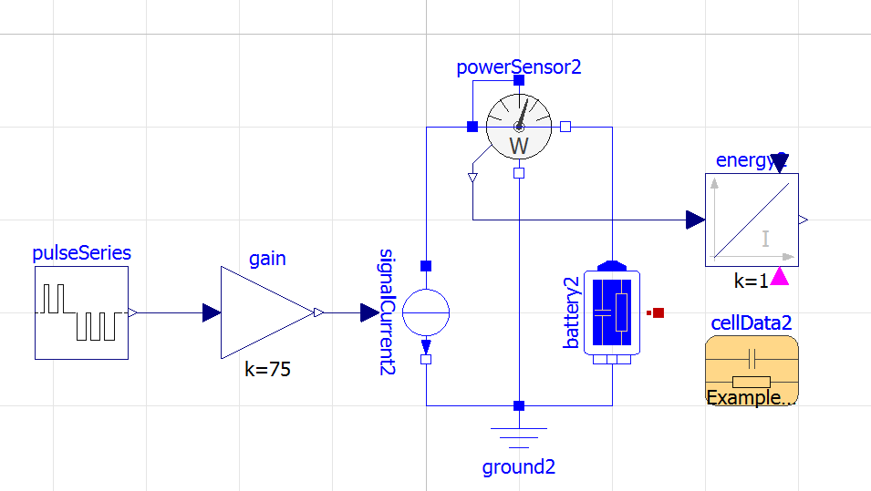

# Mathmod school 2022
# Only-Neuronets

  

## Overview

Predictive analytics in aviation case solution

Li-ion battery degradation prediction

Solution was created using Python, PyTorch, Docker and OpenModelica

Battely model example:

  

## Installation 

To install application, please run:

To compile it from source:

    git clone https://github.com/Lunettes14/Only-Neuronets

## Example
    
You can see how this works in:
   
    https://github.com/Lunettes14/Only-Neuronets/OnlyPresentation.pdf

## About

Was written by OnlyNeuronets team for MathMod school 2022

##### Notes 

